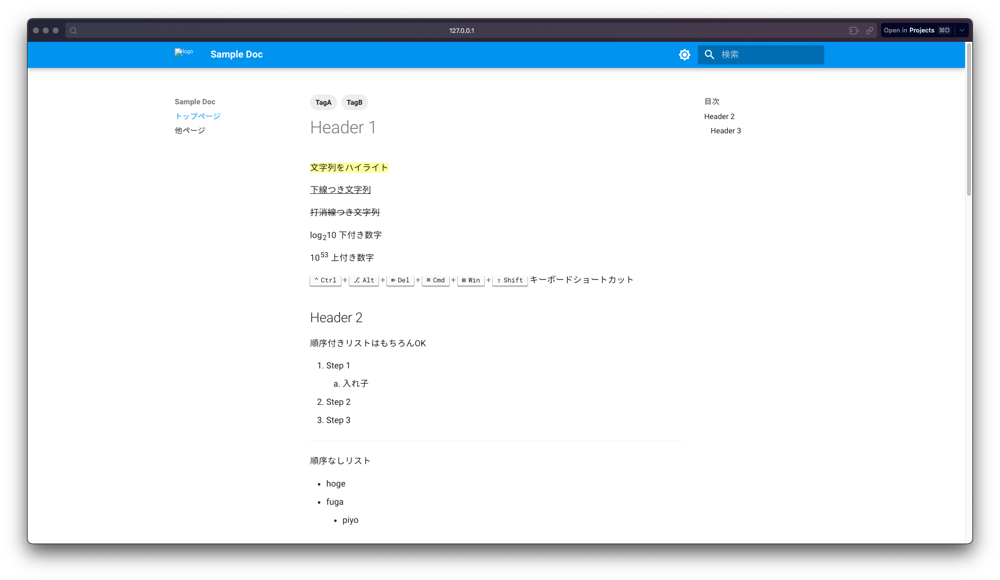

# MKDocs サンプルリポジトリ

MkDocs でドキュメントを作成する時のサンプルリポジトリです。
[Github Pages](https://sugawarayss.github.io/mkdocs_sample/) にデプロイしています。

できること
- マテリアルデザイン
- ロゴ画像、favicon
- タグ機能
- ダークモード切り替え
- 文字の装飾(ハイライト、下線付き、打消、下付き文字、上付き文字)
- キーボードショートカットの表示
- 順序付きリスト、順序なしリスト
- チェックボックス
- 定義リスト
- コードブロック、タブ付きコードブロック
- コールアウト
- ボタン
- テーブル(ソート可能)
- CSVファイルをテーブル化
- 脚注表示
- 絵文字


## ローカル実行環境構築

まず [uv](https://docs.astral.sh/uv/) (パッケージ管理ツール) をインストール
```bash
brew install uv
```

プロジェクト直下で以下のコマンドで仮想環境を作成してください

```bash
uv sync
```

## ローカルで動かしたい

以下のコマンドでローカルサーバを起動した後、ブラウザで [http://127.0.0.1:8000](http://127.0.0.1:8000)にアクセスしてください

```bash
uv run mkdocs serve
```

ブラウザでアクセスしたイメージ


## HTMLをビルドしたい

以下のコマンドでビルドできます。
ビルド成果物はプロジェクト直下に `site/` として生成されます

```bash
uv run mkdocs build
```

## Github Pagesにデプロイしたい

以下のコマンドでGithub Pagesにデプロイできます。

```bash
uv run mkdocs gh-deploy
```

## 参考リンク
- [MKDocs](https://www.mkdocs.org/)
- [Material for MKDocs](https://squidfunk.github.io/mkdocs-material/reference/)
