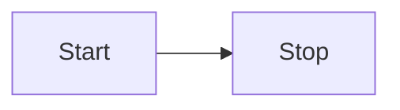

---
tags:
  - TagA
  - TagB
---

# Header 1

==文字列をハイライト==

^^下線つき文字列^^

~~打消線つき文字列~~

log~2~10   下付き数字

10^53^     上付き数字

++ctrl+alt+del+cmd+win+shift++    キーボードショートカット

## Header 2

順序付きリストはもちろんOK

1. Step 1
    1. 入れ子
2. Step 2
3. Step 3

---

順序なしリスト

- hoge
- fuga
    - piyo

---

チェックボックス

- [x] foo
- [ ] bar
    - [ ] piyo

---

定義リスト

`Hogeの定義`

:   ここに定義の説明

`Fugaの定義`
:   ここに定義の説明
---


### Header 3

タイトル付きのコードブロック
```bash title="command"
pip install mkdocs mkdocs-material
```

mermaidも表示できる


他の図の表示イメージは[こちら](mermaid.md)から

---

タブ付きコードブロック
=== "C"

    ``` c linenums="1" hl_lines="3 4"
    #include <stdio.h>

    int main(void) {
      printf("Hello world!\n");
      return 0;
    }
    ```

=== "C++"

    ``` c++ linenums="1" title="sample.cpp"
    #include <iostream>

    int main(void) {
      std::cout << "Hello world!" << std::endl;
      return 0;
    }
    ```

!!! info
    コールアウト

??? warning "タイトル付きもできる"
    折りたたみ可能(初期は折畳)なコールアウト

???+ failure
    折りたたみ可能(初期は展開)なコールアウト

[ボタン](#){ .md-button }
[塗りつぶしボタン](#){ .md-button .md-button--primary }
[アイコン付きボタン :fontawesome-solid-paper-plane:](#){ .md-button }

テーブルはソートできます

| col1 | col2 |
| :----: | ----: |
| foo  | bar  |
| hoge | fuga |


CSVファイルを読み出すこともできます

{{ read_csv("csv/sample.csv") }}

脚注[^20]もできます

[^20]: 脚注内容


絵文字もOK
:motorcycle: :dash:

<div class="annotate" markdown>
  こういう注釈(1)もできます
</div>
1. :man_raising_hand: こんにちは!


[他のファイルへのリンク](other.md)もできます
