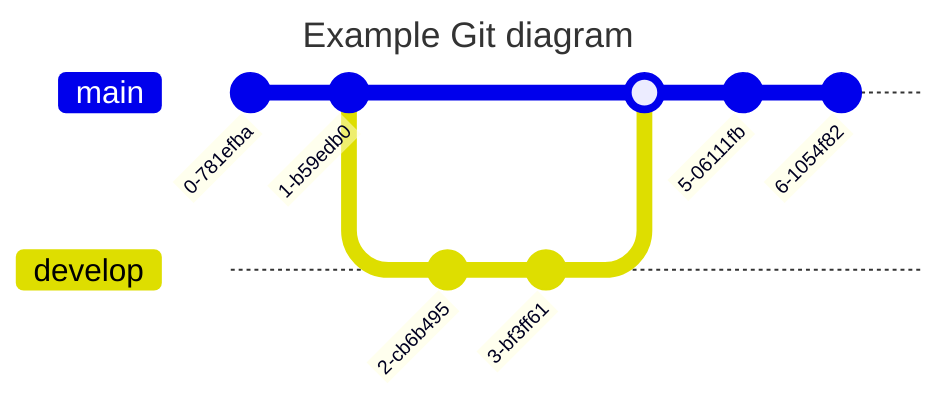

# Mermaidの表示確認

より詳細な情報は[Mermaid公式ドキュメント](https://mermaid.js.org/intro/)を参照

## フロー図

=== "左→右"

    ```markdown
    graph LR
      A[Start] --> B{Error?};
      B -->|Yes| C[Hmm...];
      C --> D[Debug];
      D --> B;
      B ---->|No| E[Yay!];
    ```

    ``` mermaid
    graph LR
      A[Start] --> B{Error?};
      B -->|Yes| C[Hmm...];
      C --> D[Debug];
      D --> B;
      B ---->|No| E[Yay!];
    ```

=== "上→下"

    ```markdown
    graph TD
      A[Start] --> B{Error?};
      B -->|Yes| C[Hmm...];
      C --> D[Debug];
      D --> B;
      B ---->|No| E[Yay!];
    ```

    ``` mermaid
    graph TD
      A[Start] --> B{Error?};
      B -->|Yes| C[Hmm...];
      C --> D[Debug];
      D --> B;
      B ---->|No| E[Yay!];
    ```

---


## シーケンス図

```markdown
sequenceDiagram
  autonumber
  Alice->>John: Hello John, how are you?
  loop Healthcheck
      John->>John: Fight against hypochondria
  end
  Note right of John: Rational thoughts!
  John-->>Alice: Great!
  John->>Bob: How about you?
  Bob-->>John: Jolly good!
```


---

## 状態遷移図
```
stateDiagram-v2
  state fork_state <<fork>>
    [*] --> fork_state
    fork_state --> State2
    fork_state --> State3

    state join_state <<join>>
    State2 --> join_state
    State3 --> join_state
    join_state --> State4
    State4 --> [*]
```


---

## クラス図

```markdown
classDiagram
  Person <|-- Student
  Person <|-- Professor
  Person : +String name
  Person : +String phoneNumber
  Person : +String emailAddress
  Person: +purchaseParkingPass()
  Address "1" <-- "0..1" Person:lives at
  class Student{
    +int studentNumber
    +int averageMark
    +isEligibleToEnrol()
    +getSeminarsTaken()
  }
  class Professor{
    +int salary
  }
  class Address{
    +String street
    +String city
    +String state
    +int postalCode
    +String country
    -validate()
    +outputAsLabel()  
  }
```


---

## テーブル相関図

```markdown
erDiagram
  CUSTOMER ||--o{ ORDER : places
  ORDER ||--|{ LINE-ITEM : contains
  LINE-ITEM {
    string name
    int pricePerUnit
  }
  CUSTOMER }|..|{ DELIVERY-ADDRESS : uses
```


---

## アーキテクチャ図
```
architecture-beta
    group api(cloud)[API]

    service db(database)[Database] in api
    service disk1(disk)[Storage] in api
    service disk2(disk)[Storage] in api
    service server(server)[Server] in api

    db:L -- R:server
    disk1:T -- B:server
    disk2:T -- B:db
```
AWSリソースのアイコンを表示することもできるらしい


---

## 四分儀図
```
quadrantChart
    title Reach and engagement of campaigns
    x-axis Low Reach --> High Reach
    y-axis Low Engagement --> High Engagement
    quadrant-1 We should expand
    quadrant-2 Need to promote
    quadrant-3 Re-evaluate
    quadrant-4 May be improved
    Campaign A: [0.3, 0.6]
    Campaign B: [0.45, 0.23]
    Campaign C: [0.57, 0.69]
    Campaign D: [0.78, 0.34]
    Campaign E: [0.40, 0.34]
    Campaign F: [0.35, 0.78]
```


---

## Git グラフ
```
---
title: Example Git diagram
---
gitGraph
   commit
   commit
   branch develop
   checkout develop
   commit
   commit
   checkout main
   merge develop
   commit
   commit
```

---

## パケット図
```
---
title: "TCP Packet"
---
packet-beta
0-15: "Source Port"
16-31: "Destination Port"
32-63: "Sequence Number"
64-95: "Acknowledgment Number"
96-99: "Data Offset"
100-105: "Reserved"
106: "URG"
107: "ACK"
108: "PSH"
109: "RST"
110: "SYN"
111: "FIN"
112-127: "Window"
128-143: "Checksum"
144-159: "Urgent Pointer"
160-191: "(Options and Padding)"
192-255: "Data (variable length)"
```


---
## 円グラフ

```markdown
pie title Pets adopted by volunteers
    "Dogs" : 386
    "Cats" : 85
    "Rats" : 15
```


---

## ガントチャート

```markdown
gantt
    title A Gantt Diagram
    dateFormat YYYY-MM-DD
    section Section
        A task          :a1, 2014-01-01, 30d
        Another task    :after a1, 20d
    section Another
        Task in Another :2014-01-12, 12d
        another task    :24d
```


## ユーザージャーニーマップ
```
journey
    title My working day
    section Go to work
      Make tea: 5: Me
      Go upstairs: 3: Me
      Do work: 1: Me, Cat
    section Go home
      Go downstairs: 5: Me
      Sit down: 5: Me
```

